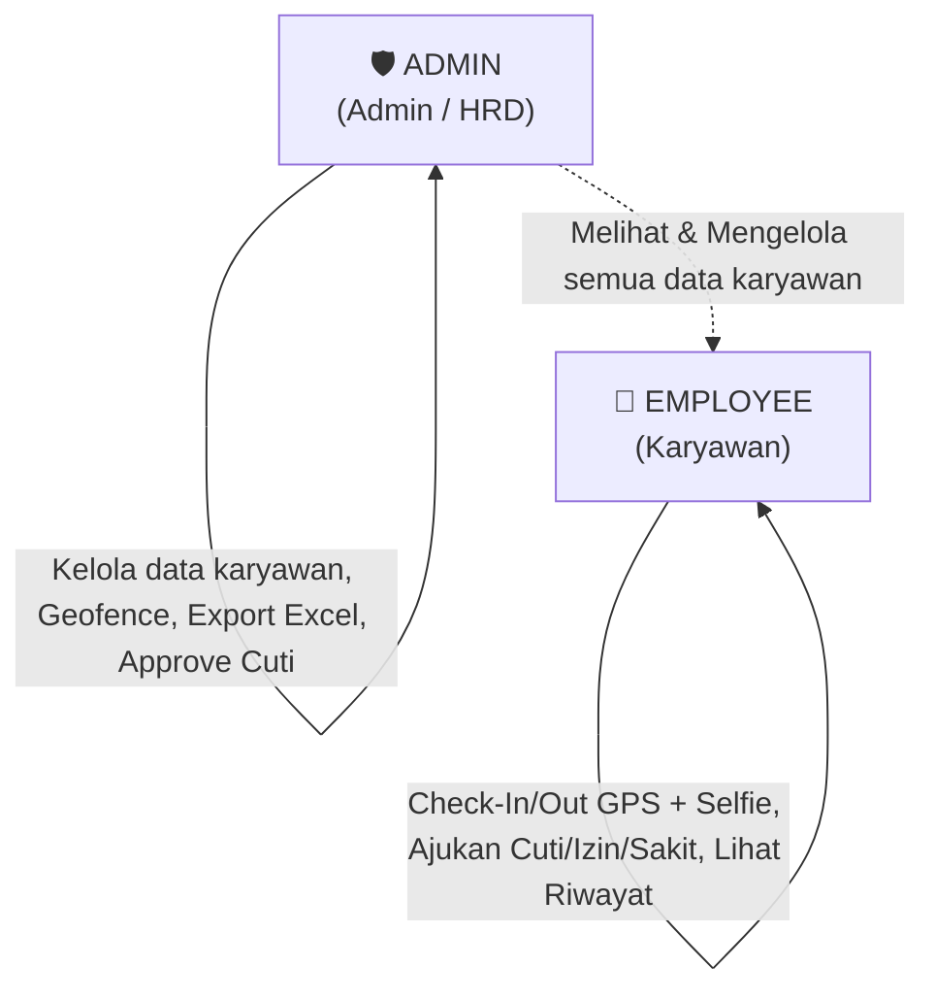

# Product Requirement Document (PRD)
# GeoSync – Enterprise Geolocation & Biometric Attendance System

> **Revisi:** Disederhanakan menjadi **2 Role** (ADMIN & EMPLOYEE) dalam **1 Aplikasi Flutter** sesuai keputusan final tim.

---

## 1. Ikhtisar Proyek (Project Overview)

| Atribut | Keterangan |
| :--- | :--- |
| **Nama Produk** | **GeoSync** |
| **Target Pasar** | Perusahaan Besar (Enterprise), Pabrik, dan Korporasi Multi-Cabang |
| **Konsep Utama** | Sistem Absensi Berbasis *Geofencing* & *Liveness Selfie* dengan Otomasi Ekspor Excel Satu Klik |
| **Pendekatan Aplikasi** | **Single Unified Application** – 1 kodebase Flutter, 2 role, tampilan menyesuaikan secara otomatis |
| **Stack Teknologi** | **Flutter + Dart** (UI/Client) + **Supabase / PostgreSQL** (Database, Auth, Storage, RLS) + **FCM** (Notifikasi) |
| **Status Dokumen** | ✅ Disetujui – Acuan Final Pengembangan |

---

## 2. Pernyataan Masalah & Tujuan

### 2.1. Masalah yang Dituju
1. **Antrean Mesin Fingerprint**: Pabrik atau kantor mengalami antrean panjang saat jam masuk/pulang, membuang waktu produktif.
2. **Kecurangan Absensi (*Buddy Punching* / Titip Absen)**: Karyawan mudah menitipkan ID card atau kredensial login kepada rekan kerja. Penggunaan aplikasi GPS palsu (*Mock Location* / Fake GPS) juga rawan terjadi.
3. **Birokrasi Kertas yang Lambat**: Pengajuan izin, sakit, dan cuti masih memakan banyak waktu dengan mengisi formulir manual yang kerap hilang atau tertunda approvalnya.
4. **Mimpi Buruk Rekapitulasi Akhir Bulan Admin/HRD**: Tim Admin harus menghabiskan berhari-hari menyatukan data mentah dari mesin fingerprint dan log spreadsheet untuk keperluan *payroll*.

### 2.2. Tujuan Solusi (Objectives)
1. **Efisiensi Absensi (< 5 Detik)**: Karyawan check-in/check-out dari smartphone dalam hitungan detik saat tiba di kawasan (*Geofence*) kantor.
2. **Keamanan Anti-Cheat**: Validasi GPS akurasi tinggi + foto *live selfie* kamera depan + deteksi Mock GPS/VPN + penguncian *Device ID Binding*.
3. **One-Click Excel Export (Core Value Proposition)**: Admin memfilter dan men-download laporan kehadiran siap-*payroll* berformat `.xlsx` langsung dari aplikasi.
4. **Sentralisasi Manajemen**: *Role-Based Access Control* (RBAC) dua tingkat dalam satu aplikasi Flutter yang menyesuaikan tampilan otomatis berdasar role pengguna.
5. **Optimasi Alur Kerja (Single Day Shift)**: Fokus pada jam kerja reguler standar (contoh: **08:00–17:00 WIB**), tanpa kompleksitas shift malam atau lintas hari.

---

## 3. Role & Hak Akses (RBAC – 2 Role)

Sistem hanya mengenal **2 role** yang dikelola via PostgreSQL *Row-Level Security (RLS)* di Supabase.



### 3.1. Role: EMPLOYEE (Karyawan)

**Target**: Seluruh staf umum, operasional pabrik, atau karyawan kantor.

| Fitur | Keterangan |
|---|---|
| **Check-In / Check-Out** | Berbasis Geofencing GPS + Live Selfie kamera depan |
| **Riwayat Absensi** | Kalender/list harian dengan indikator warna status |
| **Pengajuan Ketidakhadiran** | Form digital: Cuti Tahunan, Sakit (wajib surat dokter), atau Izin |
| **Profil & Kuota Cuti** | Tampilan NIK, Divisi, Sisa kuota cuti tahunan |
| **Notifikasi Status** | Push notification saat pengajuan cuti Disetujui / Ditolak |

### 3.2. Role: ADMIN (Admin / HRD / Pengelola)

**Target**: Staf HRD, Pengelola personalia, atau pemilik bisnis yang mengelola data karyawan.

| Fitur | Keterangan |
|---|---|
| **One-Click Excel Export** | Export laporan absensi filter tanggal/divisi → file `.xlsx` siap payroll |
| **Dashboard Overview** | Statistik real-time: Hadir, Terlambat, Cuti, Alpha hari ini |
| **CRUD Karyawan** | Tambah, edit, nonaktifkan akun karyawan & atur divisi |
| **Manajemen Geofence** | Atur titik koordinat & radius kantor cabang di atas peta |
| **Approval Cuti/Izin** | Setujui atau tolak pengajuan ketidakhadiran karyawan |
| **Reset Device ID** | Unbind IMEI perangkat karyawan yang ganti/kehilangan HP |
| **Monitor Kehadiran** | Lihat log absensi + foto selfie seluruh karyawan |

---

## 4. Spesifikasi Fitur Utama (Functional Requirements)

### 4.1. Modul Absensi & Keamanan Biometrik (Anti-Cheat)
- **Geofencing & Geotagging**: Absensi hanya diizinkan jika `Jarak Aktual <= radius_meters` (contoh: 50 meter) dari titik koordinat kantor yang di-assign ke karyawan.
- **Live Camera Selfie**: Foto diambil eksklusif dari kamera depan secara real-time (galeri HP diblokir). Gambar dikompresi di client lalu diunggah ke *Supabase Storage*.
- **Anti-Fake GPS & VPN Detection**: Memeriksa status `isFromMockProvider` (Android/iOS). Jika terdeteksi, tombol absensi dinonaktifkan dan log peringatan dikirim.
- **Device Binding (UUID Lock)**: Saat login pertama, UUID perangkat disimpan di database. Login dari perangkat lain ditolak sampai di-reset oleh Admin.
- **Server-Side Timestamp**: Waktu absensi diambil dari server PostgreSQL (`now()`) bukan dari jam lokal HP, sehingga manipulasi waktu tidak berdampak.
- **Offline Mode & Auto-Sync**: Data absensi + foto disimpan lokal (SQLite/Hive) saat sinyal hilang. Auto-upload ke Supabase saat koneksi kembali.

### 4.2. Modul Jam Kerja Reguler (Single Day Shift)
- **Standar**: Jam kerja **08:00–17:00 WIB** (konfigurasi dapat diubah oleh Admin).
- **Kalkulasi Status**:
  - Check-in ≤ `08:00 + toleransi (default 15 menit)` → **ON_TIME** 🟢
  - Check-in > `08:15` → **LATE** 🟡
  - Check-out < `17:00` → flag *Early Leave* di log Admin
- **Pencegahan Absen Ganda**: Constraint `UNIQUE(employee_id, date)` di database.

### 4.3. Modul Manajemen Ketidakhadiran
- Karyawan mengisi form: kategori (Cuti / Sakit / Izin), rentang tanggal, dan alasan.
- Kategori **Sakit**: lampiran foto surat dokter **wajib** (mandatory).
- Admin menerima push notification FCM saat ada pengajuan baru.
- Admin menyetujui (Approved) atau menolak (Rejected) dari panel khusus di dasbor.
- Saat disetujui, `leave_balance` karyawan otomatis berkurang di database.

### 4.4. Modul Ekspor Laporan Excel (Core Feature)
- Admin memilih filter (rentang tanggal, divisi, status kehadiran) lalu tap tombol **"Export .xlsx"**.
- File diproses *client-side* oleh pustaka Flutter (`excel` / `syncfusion_flutter_xlsio`) — tidak butuh server tambahan.
- **Kolom output**: NIK, Nama, Divisi, Tanggal, Jam Masuk, Jam Pulang, Total Jam Kerja, Status, URL Bukti Selfie.
- File disimpan ke storage HP/Desktop atau langsung dibagi via WhatsApp/Email.

---

## 5. Alur Navigasi Berdasarkan Role

```
Buka Aplikasi GeoSync
        │
        ▼
  [Login Universal]
  (Input NIK + Password)
        │
        ├── Role = EMPLOYEE ──────────────────► Employee Home
        │                                          ├─ Check-In / Check-Out (Big Punch Button)
        │                                          ├─ Riwayat Absensi (Kalender)
        │                                          ├─ Form Pengajuan Cuti/Sakit/Izin
        │                                          └─ Profil & Kuota Cuti
        │
        └── Role = ADMIN ────────────────────► Admin Dashboard
                                                   ├─ Overview Statistik Harian
                                                   ├─ Log Absensi + Export Excel .xlsx
                                                   ├─ Panel Approval Cuti/Izin
                                                   ├─ CRUD Data Karyawan
                                                   ├─ Setup Geofence (Peta Interaktif)
                                                   └─ Device Management (Reset IMEI)
```

---

## 6. Hal yang Sengaja TIDAK Dibangun (Out of Scope)
- ~~Role Supervisor / Manajer Divisi (dihapus)~~
- ~~Role Super Admin / IT (digabung ke ADMIN)~~
- ~~Alur approval berjenjang 2-tier (disederhanakan ke 1-tier: Admin)~~
- ~~Shift malam / lintas hari~~
- ~~Tampilan terpisah untuk Web Admin~~

---
*Berkolaborasi dengan `architecture.md`, `design-system.md`, dan `database.md`.*
