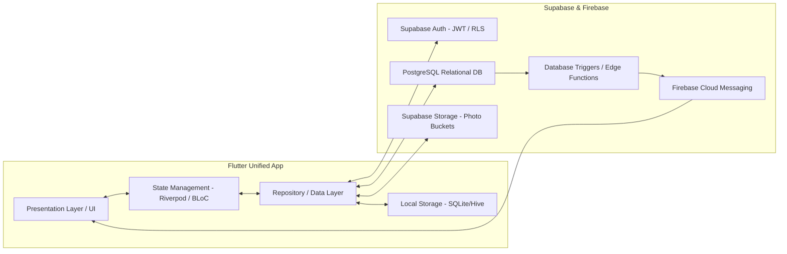
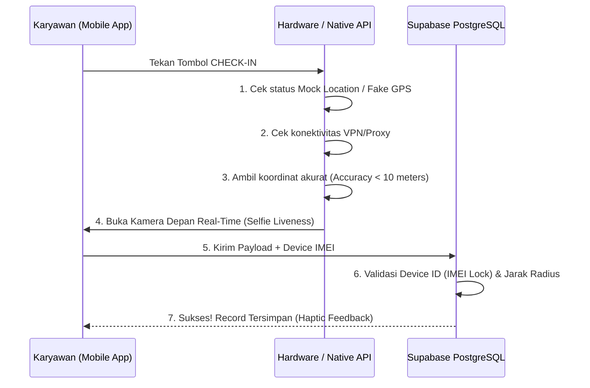

# Architecture & System Engineering Guidelines
# GeoSync – Single Unified Cross-Platform Application

---

## 1. Filosofi Arsitektur Sistem
GeoSync dibangun menggunakan prinsip **Single Unified Codebase** dengan **Flutter + Dart**. Satu kodebase ini menghasilkan aplikasi native untuk Android & iOS (`.apk` / `.ipa`). Tampilan antarmuka beradaptasi otomatis berdasarkan **2 role**: `EMPLOYEE` (layar absensi sederhana) dan `ADMIN` (dasbor manajemen penuh). Tidak ada aplikasi web atau desktop terpisah — semua berjalan dalam 1 aplikasi yang sama.



---

## 2. Struktur Folder Proyek (Clean Architecture & Feature-First)

Untuk mencegah spaghetti code dan menjaga pemisahan modularitas per fitur, struktur thư mục di dalam `lib/` dipilah berorientasi fitur (*Feature-First Separation*):

```
lib/
├── core/                       # Komponen Global & Utility
│   ├── constants/              # App Constants, Configs & Endpoints
│   ├── network/                # Supabase Client Wrapper & HTTP Error Handlers
│   ├── theme/                  # Design Tokens, Glassmorphism Cards & Colors
│   ├── utils/                  # GPS Calculation, Excel Generator Helpers, Date Formatter
│   └── widgets/                # Atomic Reusable Widgets (Buttons, Inputs, Dialogs)
│
├── features/                   # Modul Fitur Independen
│   ├── auth/                   # Authentication, Login Universal & Device UUID Binding
│   ├── attendance/             # Check-In/Out, Geolocation, Anti-Fake GPS & Live Selfie
│   ├── admin/                  # Dashboard Admin: Overview, CRUD, Geofence, Device Reset
│   ├── excel_export/           # Engine One-Click Excel Export (.xlsx – client-side)
│   ├── leave/                  # Pengajuan Cuti (Employee) & Panel Approval (Admin)
│   └── profile/                # Profil Karyawan, Riwayat Absensi & Sisa Kuota Cuti
│
├── navigation/                 # GoRouter Configurations & Role-Based Guards (2 routes)
└── main.dart                   # Entry Point & Dependency Injection (Riverpod)
```

---

## 3. Komponen Inti & State Management

### 3.1. State Management (Riverpod)
*   **Riverpod** digunakan sebagai sarana *Dependency Injection* (DI) dan manajemen status dinamis yang tahan terhadap bug rilis memori (*Type-Safe & No Runtime Exceptions*).
*   Setiap fitur memiliki arsitektur 3 lapis (Presentation $\rightarrow$ Domain/Controllers $\rightarrow$ Data Repository).

### 3.2. Role-Based Routing Guard (GoRouter Middleware)
Aplikasi dikelola menggunakan `GoRouter`. Ketika login diverifikasi dari Supabase Auth, sistem menarik metadata role (`ADMIN` atau `EMPLOYEE`) dari tabel `employees` dan mengarahkan ke salah satu dari **2 rute utama**:
```dart
// Router Guard – hanya 2 role, 2 rute
redirect: (BuildContext context, GoRouterState state) {
  final userRole = ref.read(authControllerProvider).user?.role;
  final isOnLogin = state.subloc == '/login';

  if (!isLoggedIn && !isOnLogin) return '/login';
  if (isLoggedIn && isOnLogin) {
    // 2 role, 2 tujuan — sesederhana itu
    if (userRole == Role.employee) return '/employee-home';
    if (userRole == Role.admin) return '/admin-dashboard';
  }
  return null;
}
```

---

## 4. Mekanisme Offline Mode & Auto-Sync Engine
Karena koneksi di areal pabrik atau pertambangan dapat putus tiba-tiba, logika absensi offline mutlak diperlakukan sebagai standar keselamatan data:

1. **Local Write (SQLite / Drift / Hive)**:
   * Saat jaringan mati (`ConnectivityResult.none`), data GPS, waktu aktual HP, dan file foto selfie disave instan ke storage offline smartphone, dengan atribut `sync_status = 'PENDING'`.
2. **Background Sync Worker**:
   * Sebuah *Background Service* atau *WorkManager* memantau kembalinya sinyal internet.
   * Saat sinyal pulih, sistem mengeksekusi batch upload: (1) Unggah foto lokal ke *Supabase Storage*, (2) Simpan URL foto beserta payload absensi ke PostgreSQL, (3) Update status lokal menjadi `sync_status = 'SYNCED'`.

---

## 5. Keamanan & Anti-Cheat Pipeline (Hardware Verification)

Sebelum penulisan ke database absensi terjadi, sistem melakukan validasi berantai:



1. **Anti-Fake GPS Check**: Menggunakan pemindai plugin `geolocator` dan integrasi native checking terhadap `isFromMockProvider` di Android & iOS.
2. **Device ID Checking**: Menggunakan kombinasi `device_info_plus` dan UUID unik perangkat untuk dicoba kecocokannya dengan kolom `device_id` karyawan di PostgreSQL. Jika berbeda, akses ditolak (*"Akun terikat pada perangkat lain, hubungi HRD untuk unbinding"*).
3. **Time Manipulation Protection**: Mengubah jam lokal HP tidak mempekerdayai waktu rekap, sebab `check_in_time` tidak dipasok oleh HP pengguna, melainkan dieksekusi menggunakan fungsi default server PostgreSQL (`now()` atau `TIMESTAMPTZ` dari Supabase engine).

---

## 6. One-Click Excel Export (Client-Side Engine)
Untuk menghemat beban komputasi di sisi server (Serverless benefit), pengolahan laporan Excel dilakukan secara **Client-Side Native Processing**:

1. Admin memilih filter bulan dan divisi di dasbor admin.
2. Aplikasi menjalankan *Relational Joined Query* ke Supabase PostgreSQL.
3. Package `excel` atau `syncfusion_flutter_xlsio` membangun sheet tabel secara in-memory dalam rentang waktu < 2 detik.
4. File di-generate langsung dengan ekstensi `.xlsx`, ditambahi *Styling* tabel (Header bold, warna background abu-abu/biru profesional, auto-adjust column width), lalu diserahkan ke sistem berkas HP atau Desktop Windows untuk diunduh/dibagikan.
