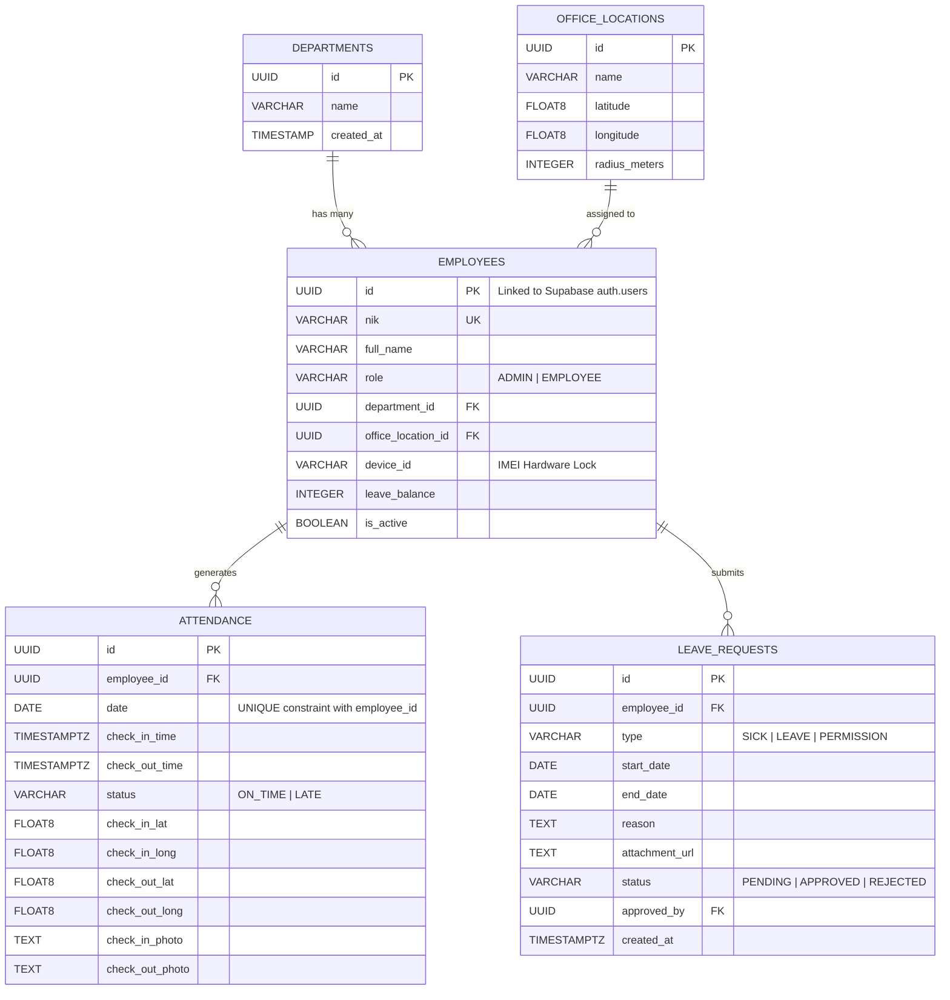

# Database Architecture & Supabase Schema (PostgreSQL)
# GeoSync – Relational Data Models & Security Policies

---

## 1. Arsitektur Relasional Database

Karena fokus utama GeoSync adalah efisiensi pengumpulan data siap pakai untuk **One-Click Excel Export**, database rancangan menggunakan PostgreSQL di lingkungan **Supabase**. Struktur berelasi (Relational) murni memungkingkan operasi `JOIN` komprehensif tanpa redundansi memori.



---

## 2. Skema DDL (Data Definition Language) PostgreSQL

Berikut adalah perintah SQL murni untuk diinjeksi ke SQL Editor Supabase guna membentuk skema database GeoSync secara komplet:

```sql
-- 1. Ekstensi UUID & Konfigurasi Awal
CREATE EXTENSION IF NOT EXISTS "uuid-ossp";

-- 2. Tabel Departments (Divisi)
CREATE TABLE public.departments (
    id UUID PRIMARY KEY DEFAULT uuid_generate_v4(),
    name VARCHAR(255) NOT NULL UNIQUE,
    created_at TIMESTAMPTZ DEFAULT now()
);

-- 3. Tabel Office Locations (Titik Geofencing)
CREATE TABLE public.office_locations (
    id UUID PRIMARY KEY DEFAULT uuid_generate_v4(),
    name VARCHAR(255) NOT NULL,
    latitude FLOAT8 NOT NULL,
    longitude FLOAT8 NOT NULL,
    radius_meters INTEGER DEFAULT 50 NOT NULL,
    created_at TIMESTAMPTZ DEFAULT now()
);

-- 4. Tabel Employees (Profil Karyawan - Berelasi ke Supabase auth.users)
-- Hanya 2 role: ADMIN (pengelola/HRD) dan EMPLOYEE (karyawan)
CREATE TYPE user_role AS ENUM ('ADMIN', 'EMPLOYEE');

CREATE TABLE public.employees (
    id UUID PRIMARY KEY REFERENCES auth.users(id) ON DELETE CASCADE,
    nik VARCHAR(50) UNIQUE NOT NULL,
    full_name VARCHAR(255) NOT NULL,
    role user_role DEFAULT 'EMPLOYEE'::user_role NOT NULL,
    department_id UUID REFERENCES public.departments(id) ON DELETE SET NULL,
    office_location_id UUID REFERENCES public.office_locations(id) ON DELETE SET NULL,
    device_id VARCHAR(255), -- Menyimpan UUID Hardware HP untuk penguncian device binding
    leave_balance INTEGER DEFAULT 12 NOT NULL,
    is_active BOOLEAN DEFAULT TRUE NOT NULL,
    created_at TIMESTAMPTZ DEFAULT now(),
    updated_at TIMESTAMPTZ DEFAULT now()
);

-- 5. Tabel Attendance (Log Absensi Harian)
CREATE TYPE attendance_status AS ENUM ('ON_TIME', 'LATE');

CREATE TABLE public.attendance (
    id UUID PRIMARY KEY DEFAULT uuid_generate_v4(),
    employee_id UUID REFERENCES public.employees(id) ON DELETE CASCADE NOT NULL,
    date DATE NOT NULL DEFAULT CURRENT_DATE,
    check_in_time TIMESTAMPTZ NOT NULL DEFAULT now(),
    check_out_time TIMESTAMPTZ,
    status attendance_status DEFAULT 'ON_TIME'::attendance_status NOT NULL,
    check_in_lat FLOAT8 NOT NULL,
    check_in_long FLOAT8 NOT NULL,
    check_out_lat FLOAT8,
    check_out_long FLOAT8,
    check_in_photo TEXT NOT NULL, -- URL gambar selfie dari Supabase Storage
    check_out_photo TEXT,
    created_at TIMESTAMPTZ DEFAULT now(),
    CONSTRAINT unique_employee_daily_attendance UNIQUE (employee_id, date)
);

-- 6. Tabel Leave Requests (Pengajuan Cuti / Sakit / Izin)
CREATE TYPE leave_type AS ENUM ('SICK', 'LEAVE', 'PERMISSION');
CREATE TYPE approval_status AS ENUM ('PENDING', 'APPROVED', 'REJECTED');

CREATE TABLE public.leave_requests (
    id UUID PRIMARY KEY DEFAULT uuid_generate_v4(),
    employee_id UUID REFERENCES public.employees(id) ON DELETE CASCADE NOT NULL,
    type leave_type NOT NULL,
    start_date DATE NOT NULL,
    end_date DATE NOT NULL,
    reason TEXT NOT NULL,
    attachment_url TEXT, -- Wajib bila type = 'SICK' (Bukti foto surat dokter)
    status approval_status DEFAULT 'PENDING'::approval_status NOT NULL,
    approved_by UUID REFERENCES public.employees(id) ON DELETE SET NULL,
    created_at TIMESTAMPTZ DEFAULT now()
);

-- 7. Index Optimasi Performa Query Excel Export HRD
CREATE INDEX idx_attendance_employee_date ON public.attendance(employee_id, date DESC);
CREATE INDEX idx_attendance_date ON public.attendance(date);
CREATE INDEX idx_employees_department ON public.employees(department_id);
```

---

## 3. PostgreSQL Row-Level Security (RLS) Policies

Aturan isolasi data diaktifkan agar tidak terjadi kebocoran atau pengaksesan ilegal antar role:

```sql
-- Aktifkan RLS di setiap tabel
ALTER TABLE public.employees ENABLE ROW LEVEL SECURITY;
ALTER TABLE public.attendance ENABLE ROW LEVEL SECURITY;
ALTER TABLE public.leave_requests ENABLE ROW LEVEL SECURITY;

-- 1. RLS untuk Tabel Employees
-- Karyawan hanya bisa membaca profilnya sendiri
CREATE POLICY "Employees can read own profile" ON public.employees
    FOR SELECT USING (auth.uid() = id);

-- Admin dapat membaca dan mengelola seluruh profil karyawan
CREATE POLICY "Admin can manage all profiles" ON public.employees
    FOR ALL USING (
        EXISTS (
            SELECT 1 FROM public.employees 
            WHERE id = auth.uid() AND role = 'ADMIN'
        )
    );

-- 2. RLS untuk Tabel Attendance
-- Karyawan hanya dapat menyisipkan dan membaca absen milik diri sendiri
CREATE POLICY "Employees insert their own attendance" ON public.attendance
    FOR INSERT WITH CHECK (auth.uid() = employee_id);

CREATE POLICY "Employees read own attendance" ON public.attendance
    FOR SELECT USING (auth.uid() = employee_id);

-- Admin dapat melihat dan mengelola seluruh data absensi (untuk export Excel & monitoring)
CREATE POLICY "Admin read all attendance" ON public.attendance
    FOR SELECT USING (
        EXISTS (
            SELECT 1 FROM public.employees 
            WHERE id = auth.uid() AND role = 'ADMIN'
        )
    );

-- 3. RLS untuk Tabel Leave Requests
-- Karyawan hanya dapat membuat dan membaca pengajuan miliknya sendiri
CREATE POLICY "Employees manage own leave requests" ON public.leave_requests
    FOR ALL USING (auth.uid() = employee_id);

-- Admin dapat melihat dan mengubah status seluruh pengajuan
CREATE POLICY "Admin manage all leave requests" ON public.leave_requests
    FOR ALL USING (
        EXISTS (
            SELECT 1 FROM public.employees 
            WHERE id = auth.uid() AND role = 'ADMIN'
        )
    );
```

---

## 4. Query Engine untuk One-Click Excel Export

Saat Admin menekan tombol **"Export Laporan Excel (.xlsx)"** dari dashboard, query relasional berikut dieksekusi ke Supabase lalu dikompilasi oleh pustaka Flutter menjadi file `.xlsx`:

```sql
SELECT 
  e.nik AS "NIK", 
  e.full_name AS "Nama Karyawan", 
  d.name AS "Divisi / Departemen", 
  o.name AS "Cabang",
  a.date AS "Tanggal", 
  TO_CHAR(a.check_in_time, 'HH24:MI:SS') AS "Jam Masuk", 
  TO_CHAR(a.check_out_time, 'HH24:MI:SS') AS "Jam Pulang",
  CASE 
    WHEN a.status = 'ON_TIME' THEN 'Tepat Waktu'
    WHEN a.status = 'LATE' THEN 'Terlambat'
    ELSE 'Tidak Diterapkan'
  END AS "Status Kehadiran",
  ROUND(CAST(EXTRACT(EPOCH FROM (a.check_out_time - a.check_in_time))/3600 AS NUMERIC), 2) AS "Total Jam Kerja (Jam)",
  a.check_in_photo AS "URL Bukti Selfie"
FROM public.attendance a
JOIN public.employees e ON a.employee_id = e.id
JOIN public.departments d ON e.department_id = d.id
JOIN public.office_locations o ON e.office_location_id = o.id
WHERE a.date >= :startDate AND a.date <= :endDate
ORDER BY a.date DESC, e.full_name ASC;
```
